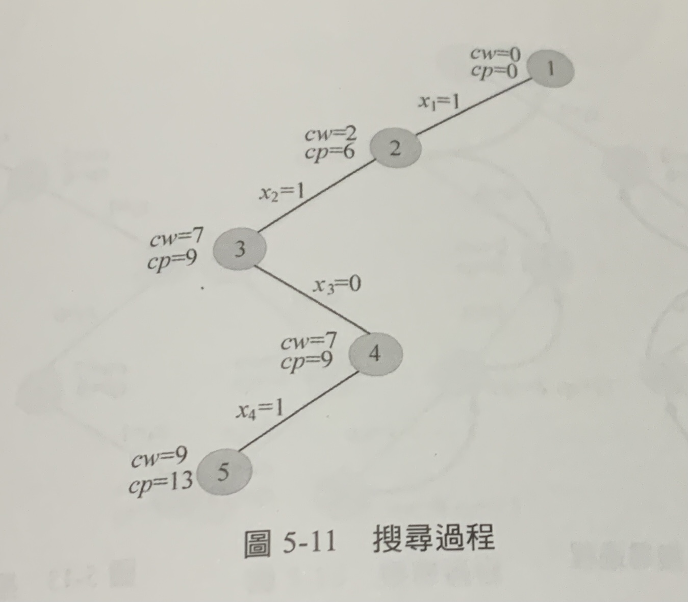

# Backpack_Problem


# Backpack 0 - 1 Problem
* 主問題：從n個物品選一些物品，在不超過最大容量下，使得價值最大。
* 解空間：{x<sub>1</sub>,x<sub>2</sub>....,x<sub>n</sub>}
  * x<sub>i</sub> : 0 or 1 (表示取或不取)
  * 共有 $2^n$ 可能的解
* 限制條件： $\sum_{i=1}^n$ $w_ix_i$ <= W
* 採用回溯法
* 限界條件：
  * 對於任何一個中間節點z，從root到z的分支所代表的狀態已經確定，從z到子孫的節點還未確定。如果z在第t層，說明第1種物品到t-1種物品（是否裝入背包）確定，t可以沿著分支擴展確認狀態，t+1到n不確定。
  * 目前裝入背包的物品總價用cp表示，因為還不確定t+1到n物品的狀態，先假設全部都放入背包，也就是剩餘的總價值，用rp表示。
  * cp + rp是所有從root出發經過中間節點z的可行解的價值上界。如果價值上界小於或等於目前的最優值，則說明節點z沒有繼續搜尋的必要
  * 即 cp + rp > bestp

## solution

假設有4個物品，每個物品w [2,5,4,2], 價值v [6,3,5,4], W = 10
1. 初始化：sumw , sumv 統計所有物品的總重和總價 -> sumw = 13, sumw = 18,目前放入背包的物品重量cw = 0, 總價cp = 0, 最優值 bestp = 0
2. 第一層：t = 1,
   * 判斷cw + w[1] = 2 < W （滿足限制條件）向左擴展分支，令x[1] = 1, cw = cw + w[1] = 2, cp = cp+v[1] = 6，生成2好節點
   * 
   * ....以此類推
   * 到t = 3, cw + w[3] = 11 > W, 因此不能放入，要判斷bound(t+1) **<是否需要剪枝>** rp(剩餘價值) = 4, cp + rp = 13 > bestp, 所以擴展右子樹，生成4號節點
   * ....
   * t = 5 ， t > n ，表示已經擴展到最底部（沒有物品了），5號擴展完畢，bestx[]保存目前的最優解
   * 回溯到4號節點，回溯需要 cw = cw - w[4] = 7, cp = cp - v[4] = 9，因為4號右邊子樹沒生成過，先判斷bound(t+1) 是否大於bestp，若無則繼續回溯，4號擴展完畢，回到3號，發現都左右考察過，再次回溯到2號。
   * 2號右子樹沒有考察過，bound(3) > bestp，擴展右邊，x[2] = 0，生成6號節點
   * .....往下看圖解
   * 參考<趣學演算法>

     1.  
     2.  
     3.  
     4.  
     5.  
    
## Code
實現function。參數可依照習慣新增或減少，或是變數用全域宣告
## bound()
```c
double Bound(int i)
{
    int rp = 0;
    while(i <= n) // n goods
    {
        rp += v[i];
        i ++;
    }
    return cp + rp;
}
```

## Backtrack
```c
void Backtrack(int t)
{
    if(t > n)
    {
        for(int j = 1; j <= n; j++)
            bestx[j] = x[j];
        bestp = cp;
        return;
    }
    if(cw + w[t] <= W) // search left subtree
    {
        x[t] = 1;
        cw += w[t];
        cp += v[t];
        Backtrack(t+1);
        cw -= w[t];
        cp -= v[t];
    }
    if(Bound(t+1) > bestp) // search right subtree
    {
        x[t] = 0;        
        Backtrack(t + 1);
    }
}
```


