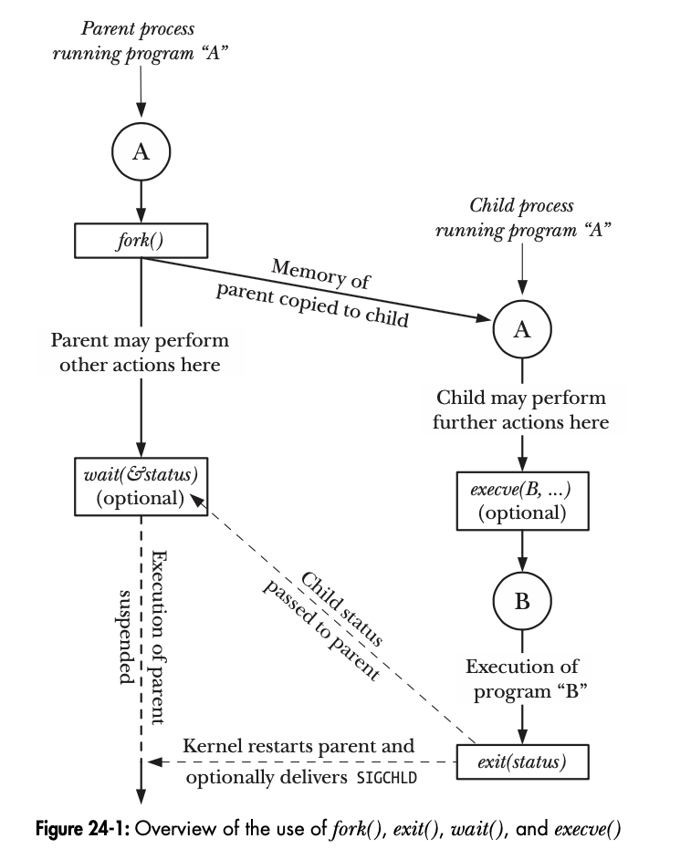

# Linux Chapter 24 CreateProcess


# CreateProcess

## fork() exit() wait() execev() 簡介
1. fork()
   * parent process經由呼叫fork()建立一個 child process 
   * child獲得parent的stack segment、data segment、heap segment、text segment
   * 可說是把parent process一分為二
2. exit()
   * terminate a process 
   * 將佔用的所有資源歸還給kernel
   * parent 可以利用 wait()來取得結束的狀態(status)
3. wait()
   * 若child process還未呼叫exit()，那wait()會suspend parent process，直到有任一child process terminated
   * 可以取得status
4. execve()
   * Load a new program到目前process的記憶體
   * 丟去現存的text segment
   * 重新建立 stack segment、data segment、heap segment

大致流程圖
 

## fork()
```c
#include <unistd.h>
pid_t fork(void);
    In parent: returns process ID of child on success, or –1 on error; in successfully created child: always returns 0
```
* 呼叫後將存在兩個process，且每個process都會**從fork()的返回處繼續執行**
* 兩個process擁有不同的stack segment、data segment、heap segment、text segment副本（child可以再修改，且不影響parent）
* 返回pid == 0是child process
* 返回pid != 0是parent process
* 無法確定誰先執行

### Parent and child 檔案共用
執行fork()後，child會有parent的file description 副本，意味著雙方對應的描述符均**指向相同的開啟檔案描述符**
* 開啟描述符包含
  * 目前的offset
  * file status flag

一個處於開啟狀態下的檔案，會在父子process中共用檔案狀態屬性
#### 用途
1. 假設父子同時寫入同一個檔案，共用檔案offset會確保兩者不會覆蓋彼此的輸出內容
   *  若有順序問題，需要行程間的同步
2. 若不需要共用這類的檔案屬性，在fork()後應：
   1. 使父子使用不同的file description
   2. 各自關閉不再使用的description

## vfork()
#### 源由與目前的fork()
在早期BSD，fork()會對文字、stack、heap等區段進行完整的複製，但經常有馬上就使用exec()的狀況，導致前面的複製動作很多餘，因此引用了vfork()，使用在fork()後立刻使用exec()的時候，增加了效率

但目前UNIX採用copy-on-write實作fork()，因此大幅消除了vfork()的需求

## 同步訊號以避免Race condition
呼叫fork()後，若A-process 需要等 B-process 完成，那B-process可以在動作完成之後向A-process發送訊號，A-process等待
#### 範例
```c
#include <signal.h> 
#include "curr_time.h" 
#include "tlpi_hdr.h"
#define SYNC_SIG SIGUSR1 /* Synchronization signal */ 
static void 
handler(int sig) /* Signal handler - does nothing but return */
{
}

int
main(int argc, char *argv[])
{
   pid_t childPid;
   sigset_t blockMask, origMask, emptyMask;
   struct sigaction sa;

   setbuf(stdout, NULL); /* Disable buffering of stdout */
   sigemptyset(&blockMask);
   sigaddset(&blockMask, SYNC_SIG); /* Block signal */ 
   if(sigprocmask(SIG_BLOCK, &blockMask, &origMask) == -1)
      errExit("sigprocmask");

   sigemptyset(&sa.sa_mask);
   sa.sa_flags = SA_RESTART;
   sa.sa_handler = handler;
   if (sigaction(SYNC_SIG, &sa, NULL) == -1)
      errExit("sigaction");

   switch (childPid = fork()) { 
      case -1:
         errExit("fork"); 
      case 0: /* Child */
         /* Child does some required action here... */
         printf("[%s %ld] Child started - doing some work\n", currTime("%T"), (long) getpid());
         sleep(2); /* Simulate time spent doing some work */

         /* And then signals parent that it's done */
         printf("[%s %ld] Child about to signal parent\n", currTime("%T"), (long) getpid());
         if (kill(getppid(), SYNC_SIG) == -1) 
            errExit("kill");

         /* Now child can do other things... */
            _exit(EXIT_SUCCESS);
      default: /* Parent */
         /* Parent may do some work here, and then complete the required action */

         printf("[%s %ld] Parent about to wait for signal\n", currTime("%T"), (long) getpid());
         sigemptyset(&emptyMask);
         if (sigsuspend(&emptyMask) == -1 && errno != EINTR)
            errExit("sigsuspend");

         printf("[%s %ld] Parent got signal\n", currTime("%T"), (long) getpid());
         /* If required, return signal mask to its original state */
         if (sigprocmask(SIG_SETMASK, &origMask, NULL) == -1) 
            errExit("sigprocmask");
         /* Parent carries on to do other things... */
         exit(EXIT_SUCCESS);
    }
}
```

## 習題
1. 下列程式執行後會出現幾個新行程？
```c
fork();
fork();
fork();
```
Ans: 
本身 -> p1, p2, p3

p1 -> p11, p12

p2 -> p21

p3

p11 -> p111

共：p1 + p2 + p3 + p11 + p12 + p21 + p111 = 7（個）


