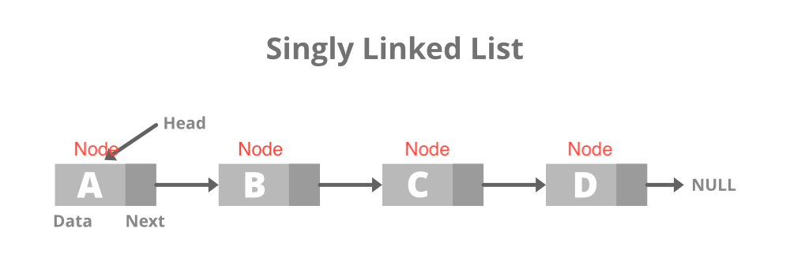

# Link List in C


# Link List

## 基本概念
1. 相同結構的東西（用struct)使用指標（pointer)串起來，相同結構的東西稱作NODE
2. 在加入/刪除比array上好操作
3. 有需要的時候才動態的配置空間(malloc / new)
4. 查詢時比array慢

圖示：



靜態配置：
```c
#include<stdio.h>
#include<stdlib.h>

struct node{
    int data;
    struct node *next;
};
typedef struct node Node;

int main()
{
    Node x, y, z;
    Node *ptr = &x;
    x.data = 10;
    x.next = &y;
    y.data = 20;
    y.next = &z;
    z.data = 30;
    z.next = NULL;

    while(ptr != NULL)
    {
        printf("address=%p, ", ptr);
        printf("data=%d ", ptr->data);
        printf("next=%p\n", ptr->next);
        ptr = ptr -> next;
    }
    return 0;
}
```
Result:
```
address=0x7ffeebebd848, data=10 next=0x7ffeebebd838
address=0x7ffeebebd838, data=20 next=0x7ffeebebd828
address=0x7ffeebebd828, data=30 next=0x0
```

動態配置：
```c
#include<stdio.h>
#include<stdlib.h>
struct node{
    int data;
    struct node *next;
};
typedef struct node Node;

int main(int argc, char *argv[])
{
    int num;
    num = atoi(argv[1]);
    Node *first, *cur, *pre;

    for(int i = 0; i < num; i++)
    {
        cur = (Node *)malloc(sizeof(Node));
        cur -> data = i + 1;
        printf("Data for Node%d: %d\n", i + 1, cur -> data);
        if(i == 0) first = cur;
        else pre -> next = cur;
        cur -> next = NULL;
        pre = cur;
    }
    cur = first;
    while(cur != NULL)
    {
        printf("address=%p, ", cur);
        printf("data=%d ", cur->data);
        printf("next=%p\n", cur->next);
        cur = cur -> next;
    }
    // free pointer
    cur = first;
    Node *tmp;
    while (cur != NULL)
    {
        tmp = cur;
        cur = cur->next;
        free(tmp);
    
    return 0;
}
```

Result:
```
$ ./Linklist 4
Data for Node1: 1
Data for Node2: 2
Data for Node3: 3
Data for Node4: 4
address=0x7f8748c05840, data=1 next=0x7f8748c05850
address=0x7f8748c05850, data=2 next=0x7f8748c05860
address=0x7f8748c05860, data=3 next=0x7f8748c05870
address=0x7f8748c05870, data=4 next=0x0
```

搜尋：
```c
Node *searchNode(Node *first, int val)
{
    Node *p = first;
    while(p)
    {
        if(p -> data == val) return p;
        else p = p -> next;
    }
    return NULL;
}
```

插入：插在某節點的後方
```c
void insertNode(Node *node, int val)
{
    Node *newNode = (Node *)malloc(sizeof(Node));
    newNode -> data = val;
    newNode = node -> next;
    node -> next = newNode;
}
```

刪除節點：
```c
Node* delete(Node *first, Node *node)
{
    Node * p = first;
    if(!p) 
    {
        printf("Nothing to delete\n");
        return first;
    }
    if(first == node) first = first->next;
    else
    {
        while(p->next != node)
            p = p -> next;
        p -> next = node -> next;
    }
    free(node);
    return first;
}
```

