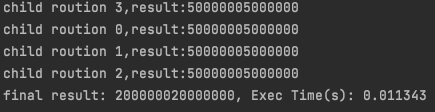

# Golang - 平行開發


# Golang 平行(parallel) 

## 簡介

### 平行(parallel)與並行(concurrent)
在執行一些需要快速計算的程式時，我們希望盡量使用CPU的多核心特性來將task平行（parallel）化，因此要分解計算任務到多個goroutine中平行運行，再合併各goroutine結果到最終result

並行(concurrent) 是一種程式架構的概念，將程式拆開成多個可以獨立運行的任務，concurrent可能會用到parallel。也就是說，concurrent可以讓很多事情一起做，但是“不一定”要真的在同一個“時間點”做。

**Parallelism 注重規劃，將能夠concurrent的程式，分配給不同硬體單元，使其同時執行。** ---> 多核心使用

## goroutine 多核

在平時直接使用 `go func()`創建goroutine，並使用`top`指令觀察，你會發現跟C語言中thread不同的是，go語言只會在某一個核心中呈現busy狀態。

* 更新：目前新版的go語言的goroutine不需要設置`runtime.GOMAXPROCS()`會自動幫你判斷能用的核心數

因此在go語言中需要使用`runtime.GOMAXPROCS(cpus)`來開啟多核心模式，`cpus`不能超過原本電腦的核心數
在go語言中可以利用`runtime.NumCPU()`獲取你電腦CPU的核心數

### 範例
```go
func sum(seq int, ch chan int) {
    defer close(ch)
    sum := 0
    for i := 1; i <= 10000000; i++ {
        sum += i
    }
    fmt.Printf("child roution%dresult:%d\n", seq, sum)
    ch <- sum
}

func main()  {
    start := time.Now()
    cpus := runtime.NumCPU()
    runtime.GOMAXPROCS(cpus) //設置運行時可使用的最大核心數
    chs := make([]chan int, cpus)
    for i := 0; i < len(chs); i++ {
        chs[i] = make(chan int, 1)
        go sum(i, chs[i])
    }
    sum := 0
    for _, ch := range chs {
        res := <- ch
        sum += res
    }
    end := time.Now()
    fmt.Printf("final result: %d, Exec Time(s): %f\n", sum, end.Sub(start).Seconds())
}
```

result: 測試環境：Macos

速度相差4倍左右

多核心：


單核心：設置`runtime.GOMAXPROCS(1)`



### 問題
既然使用多核心速度那麼快，那為何還需要控制核心數？甚至直接使用單核心？

目前我的理解是：

在CPU密集型計算中性能提升非常明顯，但如果程式中，有很多的I/O的使用，例如sql連接或是網路請求等，在I/O與CPU互相切換中，所使用的成本（時間）甚至有可能超過直接使用單核心計算的時間，因此在設計程式時，不能盲目使用平行計算。在I/O密集型程式，需要好好考慮切換的成本問題，可以考慮通過異步、coroutine解決。

可以參考 https://morsmachine.dk/go-scheduler 深入了解 go 語言scheduler，在設置GOMAXPROCS上會有更多幫助


